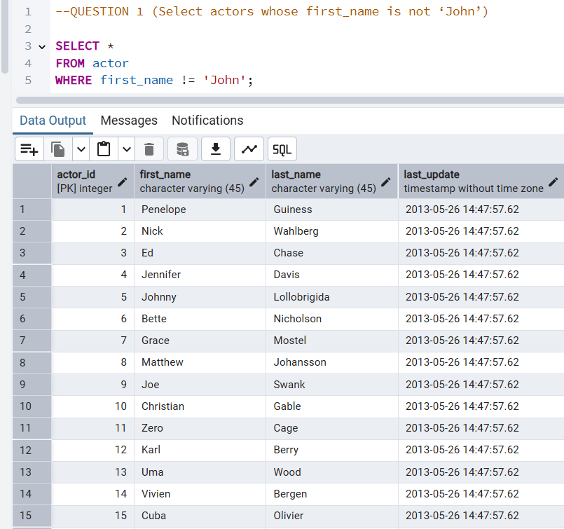
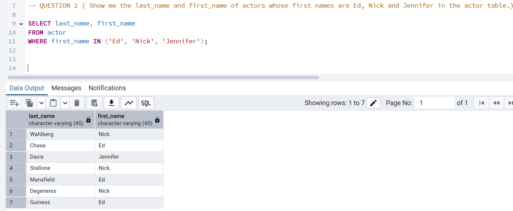
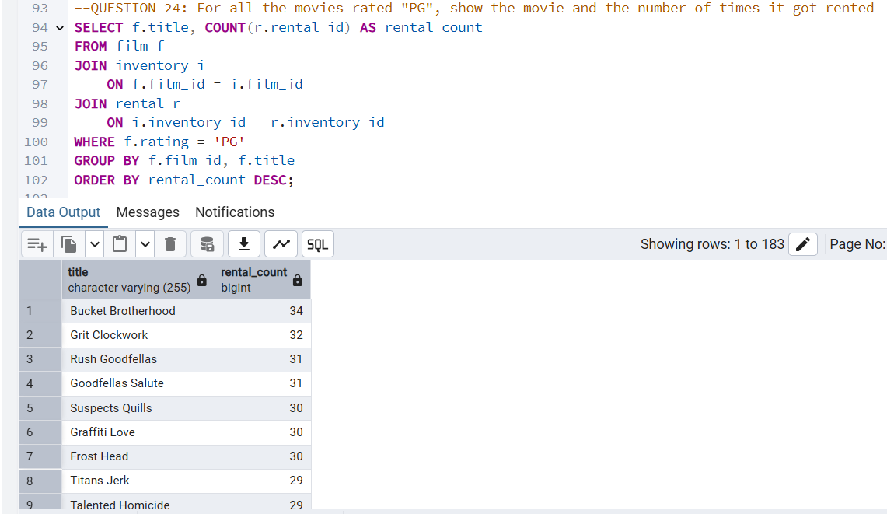
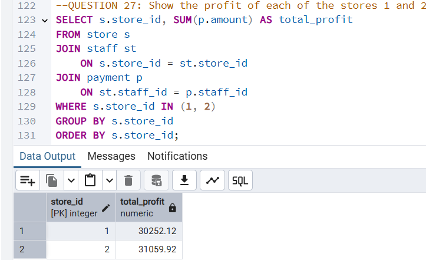

# dvdrental_data_analysis
DVD Rental Data Analysis
# 🎬 DVD Rental SQL Analysis (PostgreSQL)

This project explores the **DVD Rental database** using **PostgreSQL** to extract meaningful insights using SQL queries. It includes both basic and advanced queries such as filtering, aggregations, joins, and subqueries. Screenshots of query results are included for illustration.

---

## 🛠 Tools Used

- **Database**: PostgreSQL
- **Language**: SQL
- **IDE**: pgAdmin
- **Dataset**: [DVD Rental Sample Database](https://www.postgresqltutorial.com/postgresql-sample-database/)

---

## 🧠 SQL Questions & Insights

### Basic Queries

1. **Select actors whose first name is not ‘John’**
2. **Show actors whose first names are Ed, Nick, or Jennifer**
3. **Find actors whose last name is not ‘Smith’ and first name is ‘Tom’**
4. **Get email of loyal customer Nancy Thomas**
5. **Get phone number of customer at address '259 Ipoh Drive'**
6. **List all countries**
7. **Show the number of countries**
8. **Find 'United States' in the country table**
9. **List payments with an amount of 1.99, 2.99, 3.99, or 4.99**
10. **Display total amount paid by all customers**
11. **List all PG and PG-13 films**
12. **Classify films as Short, Medium, or Long based on duration**
13. **Classify films as Family or Other based on rating**

---

### Intermediate & Advanced Queries

14. **List customers who have not returned their DVDs**
15. **Customer with the highest total payment**
16. **Most rented movie**
17. **Movies that have been rented**
18. **Movies that have never been rented**
19. **Customers who have never rented any movie**
20. **Each movie and how many times it got rented**
21. **Actors and number of films they've acted in**
22. **Number of rented movies under each rating**
23. **Actors who acted in more than 20 movies**
24. **'PG' rated movies and their rental count**
25. **Movies available in store 1 but not in store 2**
26. **Movies offered in either store 1 or 2**
27. **Profit of stores 1 and 2**

---

---

## 🖼 Visuals

---

## 💡 Key Takeaways

- Joined multiple tables like `rental`, `film`, `inventory`, and `customer` for complex queries
- Used aggregation functions (`SUM`, `COUNT`) and conditional logic (`CASE`)
- Applied filtering with `WHERE`, `IN`, `NOT IN`, `BETWEEN`, `IS NULL`
- Demonstrated how SQL can be used for both customer and business-level insights

---

## 📫 Contact
- **[Chioma Nnadi]**
- 📧 [Email](nnadicvictoria@gmail.com)
- 🔗 [Linkedin](https://www.linkedin.com/in/nnadichioma/)

